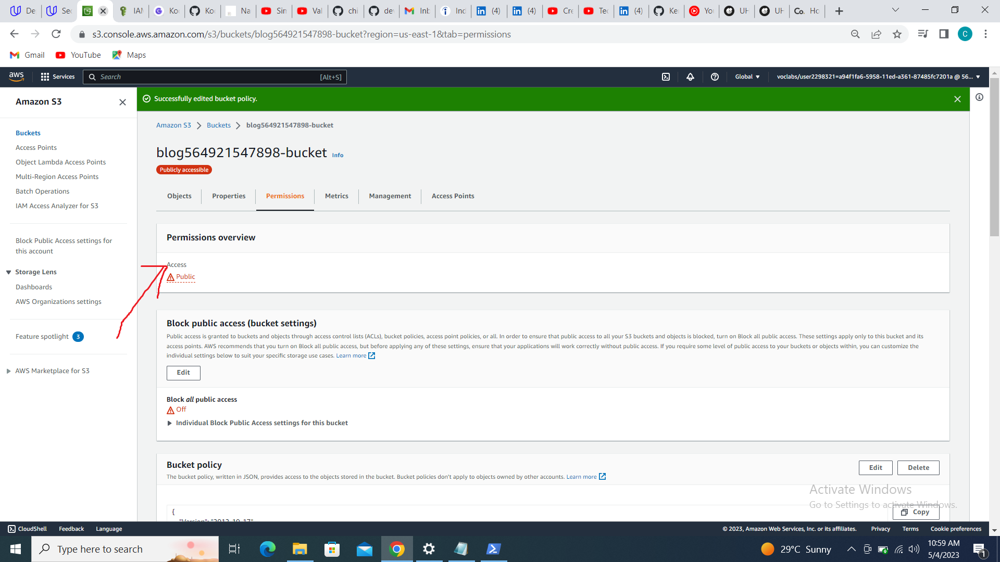
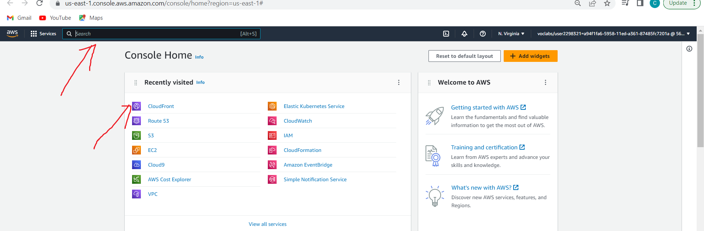
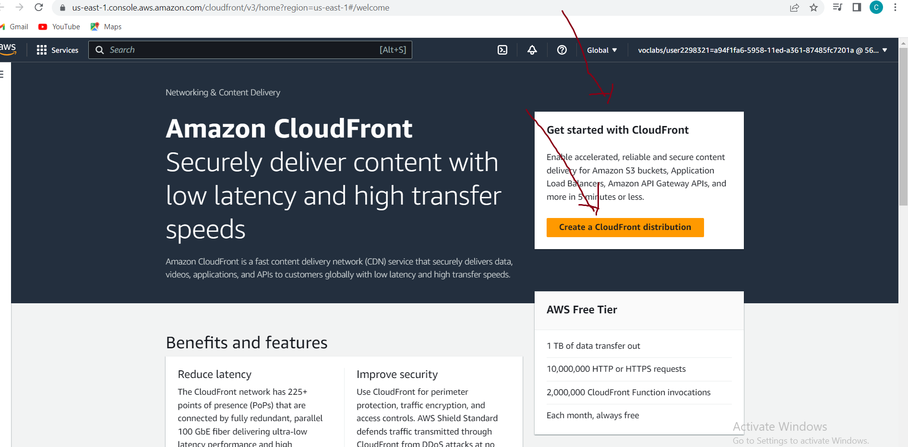

# THIS PROJECT DEMONSTRATES HOW TO DEPLOY STATIC WEBSITE ON AN S3 BUCKET AND DISTRIBUTE USING CLOUDFRONT

#### __Services Required__
#### - S3 - to create bucket and upload source code
#### - Cloud front -AWS global content delivery network, that speeds up distribution of your static and dynamic web content (such as .html, .css, image and .js files) to your users 
#### - Cloud Provider = AWS

#### 1. Login to your AWS account, from the management console's home page, search for s3 using the searchbar or from recently visited or from list of favorites (click on s3)

#### 2. On s3 dashboard, click the create bucket button to create a bucket

#### 3. Give bucket a unique global name, 

#### 4. Disable block public access settings for this bucket, so as to make this bucket publicly visible, then acknowledge.

#### 5. Bucket is created

#### 6. Upload files to the bucket either using drap and drop, the upload button or awscli
#### I used awscli to upload really big folders
#### aws s3 cp vendor/ s3://my-bucket-202203081/vendor/ --recursive 
#### aws s3 cp css/ s3://my-bucket-202203081/css/ --recursive 
#### aws s3 cp img/ s3://my-bucket-202203081/img/ --recursive 

#### 7. Go to permissions tab to secure bucket via IAM

#### 8. Edit bucket policy and ensure resource is the current bucket's name

#### 9. Notice the objects in the bucket are now _publicly accessible_ (this is required for static website hosting)

#### 10. Click __edit static website hosting__ and enable static website hosting, then specify your index and error document/page. I used index.html as my index and error document.

#### 11. Copy bucket website endpoint and paste on a browser

#### 12. Notice that the website is visible using the bucket website endpoint
 
#### 13. Search for cloudfront on the searchbar

#### 14. On cloudfront's dashboard, click on create a cloudfront distribution 

#### 15. Name origin domain with _bucket website endpoint_ (do not select from dropdown), leave other fields with their default values
  

#### 16. Cloudfront distribution has been created, and is still in __deploying__ state

#### 17. Cloudfront state is now in deployed copy domain name and paste on the browser

#### 18. The website can be accessed via:
#### __website endpoint__

#### OR THE __cloudfront URL__

#### I cleaned up by deleting the objects (files) in my bucket and deleting my cloudfont distribution.
